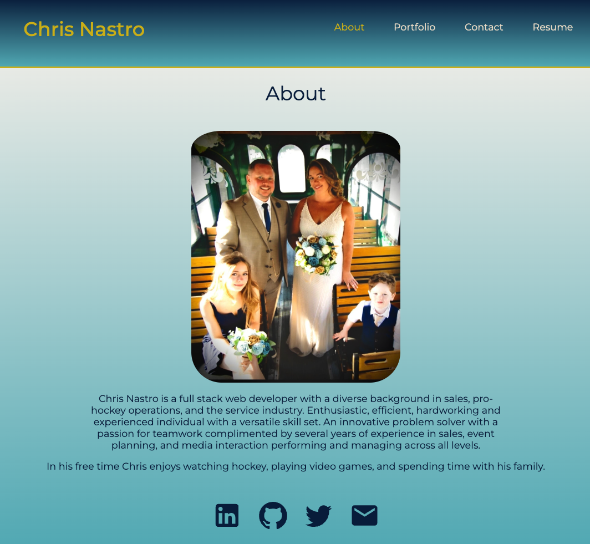

# Chris Nastro React Portfolio

### Table of Contents
- [Overview](#Overview)
- [Screenshot](#Screenshot)
- [Submission](#Submission)
- [Credit](#Credit)

## Overview

Welcome to my React Portfolio!  The Portfolio highlights six of my builds done in the Rutgers Full Stack bootcamp.  Please feel free to use the contact page to get in touch!

## Screenshot

## Submission

* [Deployed Site](URL HERE)

* [GitHub Repo](https://github.com/chrisnastro/week18hw_NoSQL)

## Credit

Proficiency list, form warnings, and some CSS formatting taken from [Ryan Messett](https://github.com/rmessett15)

---
© 2024 edX Boot Camps LLC. Confidential and Proprietary. All Rights Reserved.
